# �️ **SPARTACUS FITNESS** 
### *Elite Workout Generation & Performance Analytics Platform*

<div align="center">


[](https://github.com/yourusername/spartacus-fitness)
[](LICENSE)
[](https://nodejs.org/)
[](https://postgresql.org/)

*Transform your fitness journey with intelligent workout generation, real-time analytics, and social competition*

</div>

---

## 🎯 **Overview**

Spartacus Fitness is a comprehensive workout management platform that combines personalized exercise recommendations with advanced analytics and social features. Built with modern web technologies, it offers everything from interactive muscle mapping to competitive leaderboards.


*Main dashboard showing personalized recommendations and user progress*

---

## ✨ **Key Features**

### 🎨 **Interactive Exercise Explorer**
- **3D Muscle Mapping**: Visual body anatomy with clickable muscle groups
- **Advanced Filtering**: Filter by difficulty, equipment, muscle groups
- **Comprehensive Exercise Database**: 500+ exercises with detailed instructions
- **Media Support**: Exercise videos and images for proper form


*Interactive muscle map with exercise filtering*

### 💪 **Intelligent Workout Generation**
- **AI-Powered Recommendations**: Based on user profile, goals, and history  
- **Customizable Parameters**: Duration, difficulty, equipment availability
- **Balanced Programming**: Ensures proper muscle group distribution
- **Progressive Overload**: Automatic difficulty adjustments over time


*Smart workout generation process*

### 📊 **Advanced Analytics & Tracking**
- **Real-Time Progress Charts**: Visual progress tracking with interactive graphs
- **Performance Metrics**: Volume, frequency, and consistency analysis
- **Body Composition Tracking**: Weight, measurements, and photos
- **Workout History**: Detailed logs with searchable exercise database


*Competitive leaderboards with ranking system*

### 📱 **Mobile-First Design**
- **Responsive Layout**: Optimized for all devices (especially Samsung Galaxy S10+)
- **Touch-Friendly Interface**: Large buttons and swipe gestures
- **Offline Capability**: Core features work without internet
- **Progressive Web App**: Install on mobile devices


*Mobile-optimized interface design*

---

## 🏗️ **System Architecture**

### Technology Stack
```
Frontend:  HTML5, CSS3, Vanilla JavaScript
Backend:   Node.js, Express.js
Database:  PostgreSQL
Tools:     Multer, PDFKit, JSON2CSV, Feed
```

### Architecture Diagram

```mermaid
graph TD
    A[👤 User] -->|HTTPS| B[🌐 Frontend SPA]
    B -->|REST API| C[⚡ Express Server]
    C -->|SQL Queries| D[🗄️ PostgreSQL DB]
    
    C --> E[📊 Analytics Engine]
    C --> F[🤖 Workout Generator]
    C --> G[📱 Export System]
    
    E --> H[📈 Chart Generation]
    F --> I[💡 AI Recommendations]
    G --> J[📄 PDF Reports]
    G --> K[📡 RSS Feeds]
    
    style A fill:#e1f5fe
    style B fill:#f3e5f5
    style C fill:#e8f5e8
    style D fill:#fff3e0
```



---

## 🚀 **Quick Start**

### Prerequisites
- Node.js 18+ 
- PostgreSQL 14+
- Git

### Installation

1. **Clone the repository**
   ```bash
   git clone https://github.com/yourusername/spartacus-fitness.git
   cd spartacus-fitness
   ```

2. **Install dependencies**
   ```bash
   npm install
   ```

3. **Configure database**
   ```bash
   # Create .env file
   cp .env.example .env
   
   # Edit database configuration
   nano .env
   ```

4. **Initialize database**
   ```bash
   npm run setup-db
   ```

5. **Start the application**
   ```bash
   npm start
   ```

6. **Access the application**
   - Frontend: `http://localhost:3000`
   - Admin Panel: `http://localhost:3000/admin.html`


---

## 🎮 **User Guide**

### 🏠 **Getting Started**
1. **Registration**: Create account with email verification
2. **Profile Setup**: Enter age, weight, height, fitness goals
3. **Equipment Selection**: Choose available equipment
4. **First Workout**: Generate your personalized routine

### 💪 **Core Workflows**

#### **Exercise Discovery**
- Browse interactive muscle map
- Search by name, muscle group, or equipment
- Filter by difficulty level
- View detailed instructions and media


#### **Workout Generation**
- Select target muscle groups
- Choose workout duration
- Set difficulty preference  
- Generate balanced routine
- Save to personal library


#### **Progress Tracking**
- Log completed workouts
- Track weights, reps, and sets
- Monitor weekly/monthly progress
- View performance analytics


---

## 🔧 **Admin Features**

### 👑 **Administrative Dashboard**
- **User Management**: View, edit, suspend user accounts
- **Exercise Management**: Add, edit, delete exercises
- **Content Moderation**: Review user-generated content
- **System Analytics**: Platform usage statistics


### 📊 **Analytics & Reporting**
- **User Engagement Metrics**: Active users, session duration
- **Popular Exercises**: Most-used exercises and equipment
- **Performance Reports**: System performance monitoring
- **Export Tools**: Data export for analysis


---

## 📊 **Data Management**

### 📥 **Import/Export Features**
- **Workout Export**: PDF, JSON, CSV formats
- **RSS Feeds**: Subscribe to workout updates
- **Data Backup**: Personal data export
- **Integration APIs**: Connect with other fitness apps


### 🔒 **Privacy & Security**
- **Data Encryption**: All sensitive data encrypted
- **GDPR Compliance**: Full data protection compliance
- **Privacy Controls**: Granular privacy settings
- **Secure Authentication**: JWT-based authentication

---

## 📱 **Mobile Experience**

### 📲 **Responsive Design**
- **Mobile-First**: Optimized for smartphones
- **Touch Interface**: Large, accessible buttons
- **Gesture Support**: Swipe navigation
- **Offline Mode**: Core features work offline


### 🔔 **Notifications**
- **Workout Reminders**: Customizable reminder schedule
- **Progress Alerts**: Achievement notifications
- **Social Updates**: Friend activity updates
- **System Announcements**: Platform updates

---

## 🏆 **Competitive Features**

### 🥇 **Leaderboard System**
- **Global Rankings**: Worldwide user competition
- **Age Categories**: Fair competition grouping
- **Weekly Challenges**: Rotating fitness challenges
- **Achievement Badges**: Unlock special rewards


### 🤝 **Social Integration**
- **Friend System**: Connect with workout partners
- **Workout Sharing**: Share routines and progress
- **Community Challenges**: Group fitness goals
- **Motivation Tools**: Encouragement and support

---

## 🛠️ **Technical Details**

### 📚 **API Documentation**
- **RESTful Design**: Standard HTTP methods
- **JSON Responses**: Consistent data format
- **Authentication**: JWT token-based
- **Rate Limiting**: API abuse protection

### 🗄️ **Database Schema**
- **Users & Profiles**: User account management
- **Exercises & Muscles**: Exercise library
- **Workouts & Logs**: Workout tracking
- **Media & Files**: File storage system


---

## 🚀 **Performance**

### ⚡ **Optimization Features**
- **Fast Load Times**: < 2 second page loads
- **Efficient Queries**: Optimized database operations
- **Caching Strategy**: Smart content caching
- **CDN Integration**: Global content delivery

### 📈 **Scalability**
- **Horizontal Scaling**: Multi-server deployment
- **Database Optimization**: Query performance tuning
- **Load Balancing**: Traffic distribution
- **Monitoring**: Real-time performance tracking

---

## 🔮 **Future Roadmap**

### 🎯 **Upcoming Features**
- [ ] **AI Personal Trainer**: Voice-guided workouts
- [ ] **Nutrition Tracking**: Meal planning integration
- [ ] **Wearable Integration**: Smartwatch connectivity
- [ ] **Video Workouts**: Streaming workout classes
- [ ] **Community Forums**: User discussion boards

### � **Long-term Vision**
- **Machine Learning**: Advanced personalization
- **Virtual Reality**: Immersive workout experiences
- **IoT Integration**: Smart gym equipment connectivity
- **Global Expansion**: Multi-language support

---

## 🤝 **Contributing**

We welcome contributions! Please see our [Contributing Guide](CONTRIBUTING.md) for details.

### 🛠️ **Development Setup**
```bash
# Fork the repository
git clone https://github.com/yourusername/spartacus-fitness.git

# Create feature branch
git checkout -b feature/amazing-feature

# Make changes and commit
git commit -m "Add amazing feature"

# Push to branch
git push origin feature/amazing-feature

# Open Pull Request
```

---

## 📞 **Support**

### 🆘 **Get Help**
- **Documentation**: [Wiki](https://github.com/yourusername/spartacus-fitness/wiki)
- **Issues**: [GitHub Issues](https://github.com/yourusername/spartacus-fitness/issues)
- **Community**: [Discord Server](https://discord.gg/spartacus-fitness)
- **Email**: support@spartacusfitness.com

### 📊 **Project Stats**
- **⭐ Stars**: Give us a star if you like the project!
- **🐛 Issues**: Report bugs and request features
- **🔄 Pull Requests**: Contribute to the codebase
- **📈 Contributors**: Join our growing community

---

## 📄 **License**

This project is licensed under the MIT License - see the [LICENSE](LICENSE) file for details.

---

<div align="center">

**Made with ❤️ by the Spartacus Fitness Team**


[⬆ Back to Top](#-spartacus-fitness)

</div>
